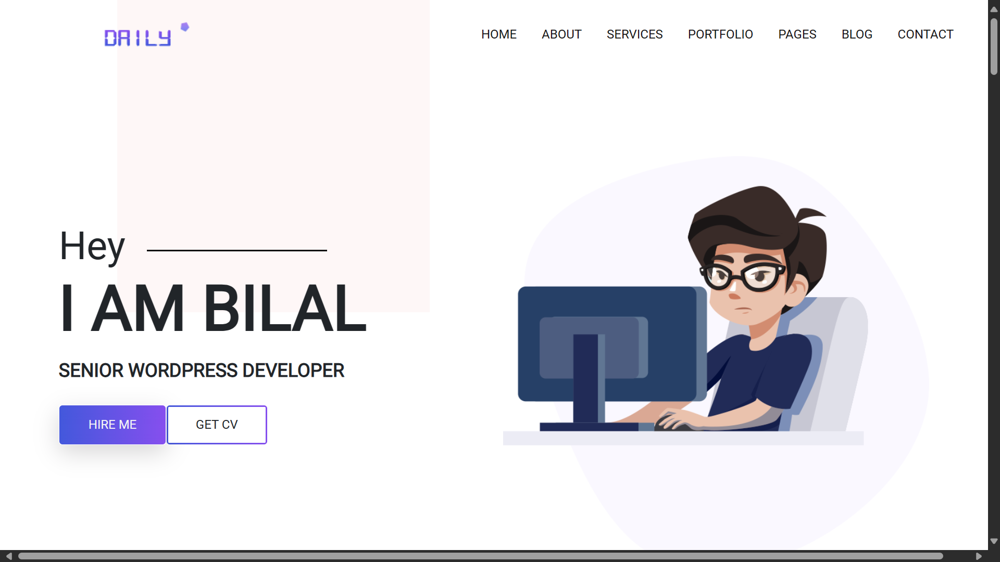
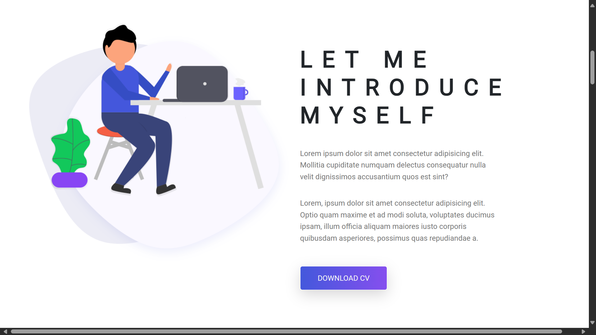
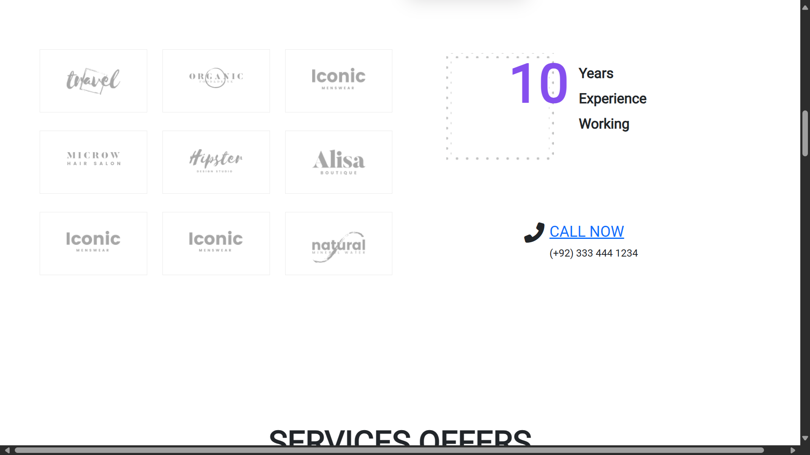
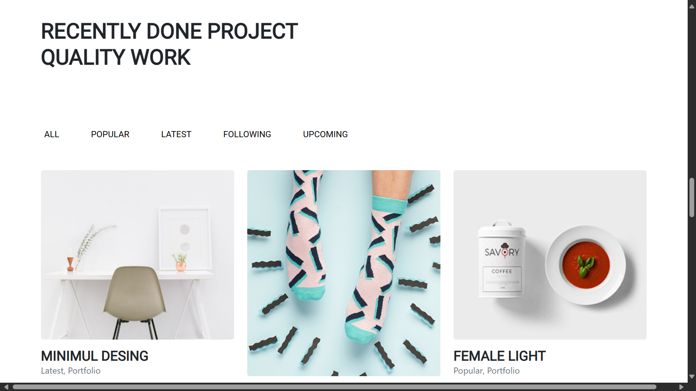
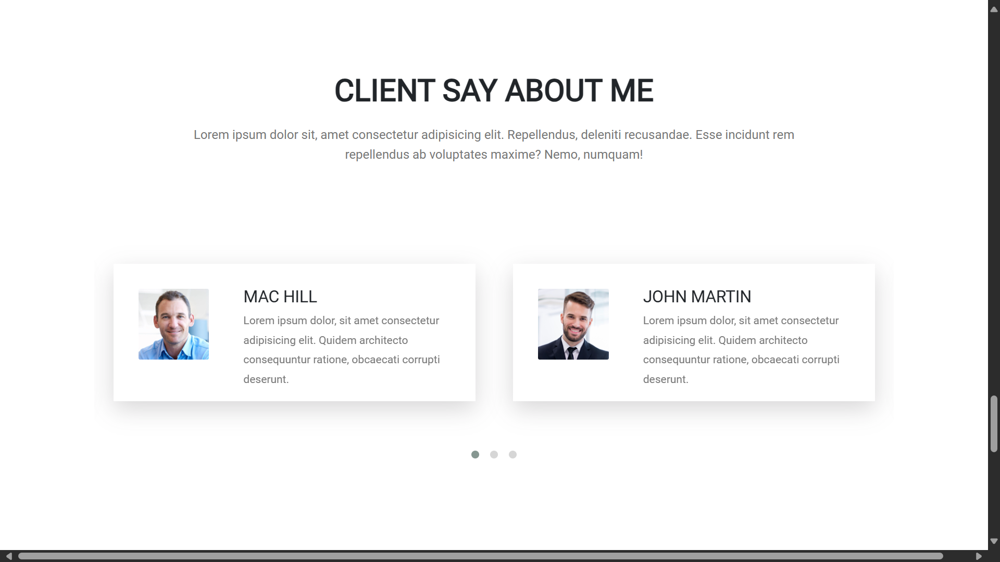
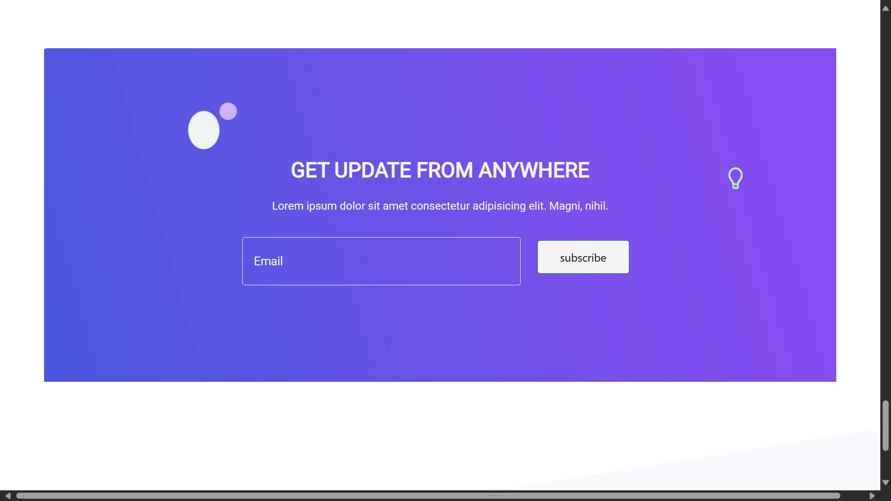

# 🌐 Portfolio Daily Website

Welcome to my portfolio website! This project is a showcase of my skills and projects in web development. Feel free to explore and learn more about me and my work.

## 🔗 **Project URL**  
Visit the website [here](https://portfolio-daily-website.netlify.app/).

## 🖼️ Project Screenshots
Take a look at some screenshots from the website:

## 🛠️ Technologies Used
This project was built with the following technologies:
- HTML 📝
- CSS 🎨
- Bootstrap 📚

## 🚀 Getting Started
To run this project locally, follow these steps:
1. Clone the repository: `git clone https://github.com/Bilal00404/portfolio-daily-website.git`
2. Open the project folder in your code editor.
3. Open `index.html` in your browser to view the website.

## 📧 Contact
If you have any questions or suggestions, feel free to reach out:
- Email: bilalchanna67@gmail.com ✉️
- LinkedIn: [Profile](https://www.linkedin.com/in/muhammad-bilal-bilal0040/) 💼
